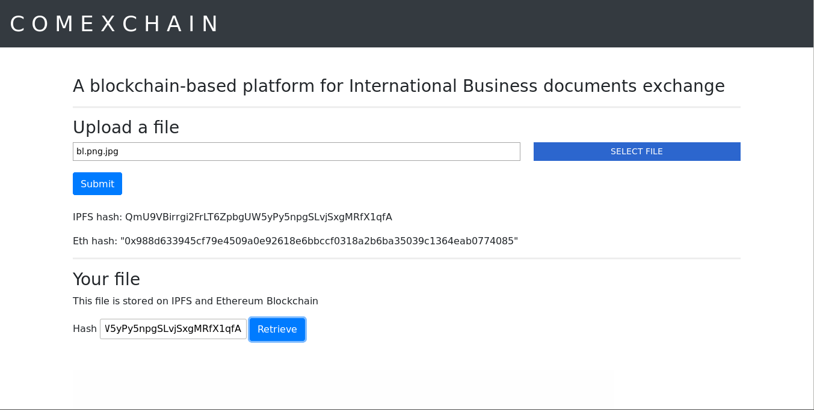

# C O M E X C H A I N

A blockchain-based platform for International Business documents exchange.
  - Ethereum blockchain registration
  - Interplanetary file system storage 
  - Interoperability



## Pre-requirements
Make sure you have the following tools and components before starting to startup the environment to run the prototype:
* [Node.js](https://nodejs.org/en/)
* [npm (Node Package Manager)](https://www.npmjs.com/)
* [geth (Go-Ethereum)](https://github.com/ethereum/go-ethereum)
* [Remix Web IDE](http://remix.ethereum.org/)

## Getting started
The Comexchain prototype is executed locally, running a local Ethereum network to simulate transactions on its network. Remix Web IDE will be used to visualize the transactions being commited.

### Setting up the local Ethereum blockchain
#### Remix IDE
1) On Remix IDE, add [`ComexDocStorage.sol`](src/ComexDocStorage.sol) file and compile it.
2) Copy the contract ABI by clicking "ABI", to the right of "Details" button, in tab "Compile".
3) Paste it assigning it to `contractABI` constant, 3rd assigning in `storeOnEthereum()` function ([`server.js`](src/server.js)) (`const contractABI = <paste here>`).
4) Execute the instructions in the next section (Creating Ethereum account).

#### Creating Ethereum account
Using the command line, from the root project directory run the following commands:
```sh
$ geth init genesis.json --datadir blocks/
$ sudo geth -port 30303 --ws --wsport=8445 --wsorigins "*" --wsaddr "0.0.0.0" --wsapi personal,db,eth,net,web3,pubsub --datadir "blocks" --networkid 1 --rpcapi personal,db,eth,net,web3,pubsub --rpc --rpcport 8545 --rpccorsdomain "*" --rpcaddr "0.0.0.0" console
```
(running `geth`, type a password for your wallet when solicited (save your account address).
```sh
> personal.newAccount()
(password)
(retype password)
> personal.unlockAccount(eth.accounts[0])
(password just created)
> miner.start()
```
Your computer is mining, let this running. It is needed for deploy the smart contract through Remix and for further transactions (being executed by the Comexchain prototype through the web page, transparent for the user).

#### Remix IDE and server.js changes
1) Again on Remix IDE, tab "Run", select "Web3 Provider" as the Environment.
2) Paste your account address on "Account" field, below the "Environment" field.
3) Paste the same value to the first assignment of `storeOnEthereum()` (`const ADDRESS = '<paste here>'`). Also, assign your account address (You've created recently, using `geth`).
4) Deploy ComexDocStorage contract by clicking on "Deploy" (red button).
5) Bellow, a field "Deployed Contracts" will appear. Copy ComexDocStorage address and assign it to `contractAddress` variable, after `const contractABI` (`storeOnEthereum()`, [`server.js`](src/server.js)) (`var contractAddress = '<paste here>'`).

### Running Node.js server
Without stop the mining, run on `/src`
```sh
npm i
npm start
```
Now you can access `http://localhost:8080` on your browser and test the prototype. Upload a file (e.g [`bill-of-lading.jpg`](media/bill-of-lading.jpg)) and click `Submit`. In some seconds (when the transaction is being mined) you'll be able to see the hash of the file and the hash of the blockchain transaction. The first one can be pasted in the last field of the page, due to retrieve the file stored on [IPFS](https://ipfs.io/).

If the file submited was an image, then clicking "Retrieve" you'll be able to see it at the bottom of the web page.
You can also copy the file hash and check that the file was really stored on IPFS by accessing https://ipfs.io/ipfs/file_hash.
To verify if the transaction was really commited, you have its hash, and also you can go to Remix IDE, click `get` in "Deployed Contracts" field to execute `get()` smart contract function and see what is the value of `ipfsHash` variable.
